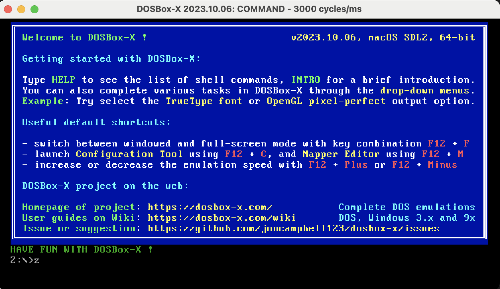
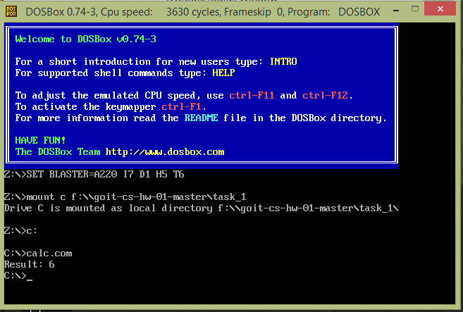

# goit-cs-hw-01

Assembler basics. Assembler program for arithmetic operations execution. Interpreter creation (Python). Basic Interpreter class realisation with ability to perform basic arithmetical operations: addition, subtraction, multiplication, division.

# task_1

 - Create assambler script for arythmetic operation execution.
To run the script first of all we should compile it into .com file by running the next command:
```
    nasm -f bin -o task_1/calc.com task_1/calc.asm
```
 - Then to run this script we can use DOSBox Windows emulator, which can be downloaded from the official site https://www.dosbox.com/download.php?main=1 according to your operational system
For Mac users it could be installed with the help of brew:
```
    brew dosbox-x
```
 - Then you can run it performing in the terminal:
```
    dosbox-x
```
 - DosBox window in the next view will appear:



 - We should mount a disk for .com programs execution running the command below. Use full path to the folder where compiled .com file is placed
```
    mount c /Users/user_name/fullpath/goit-cs-hw-01/task_1
```
 - Then move to the mounted disk:
```
    c:
```
 - And execute the desired .com program
```
    calc.com
```
 - You should see the next result of the execution:




# task_2

Basic Interpreter class realisation with ability to perform basic arithmetical operations: addition, subtraction, multiplication, division. 

Run the main.py file in the root directory and enter desired arithmetical operations for execution. For example:  2 + 10 , 10 * (8 - 6) , 15 / 3 , 100 / (10 - 5) , etc. Enter "exit" to finish program execution.


